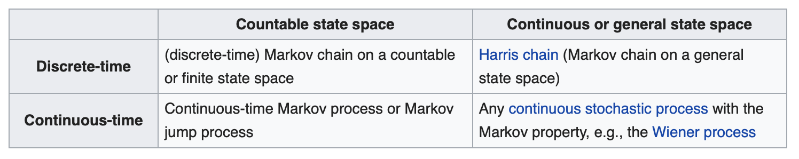

##Introduction

- Business objective. 
Predicting movements of stock market is a big topic today within the financial industry. Banks, hedge funds and other organizations always in the constant research to improve accuracy of prediction and therefore to maximize return for investors.

Purpose of this project is make an attemp to predict the movement of S&P 500 index. 

- Process
The analysis is splitted into three parts:
1) Application of random forest on data about S&P 500 index
2) Time series analysis and prediction using ets and arima
3) Reproduction of Hidden Markov Model for Financial Time Series and Its Application to S&P 500 Index paper by Stephen H.-T. Lihn to illustrate Hidden Markov Model application

- Data
Most of the financial data on the S&P 500 index is downloaded from CRSP data depository at Wharton Research Data Services
Also data on the volatility index is being scrapped from CBOE using quantmod package and getSymbols function
For Hidden Markov Model we use package ldhmm. All the data for S&P 500 and VIX index is predownloaded in the package.  

- Results
As we said in the beginning prediction of stock market movement is a complicated task that requires not only  full and comprehensive understanding of stock market, macro environment, political situation etc but also a lot of computational power and knowledge of advanced math and statistical tools. 

Our analysis showed that using random forest with limited data gives model with 53% accuracy, time series analysis model produces massive error and only HMM could predict volatility with certain degree of accuracy.  

-Acknowledgement: 
Christos Oikonomou, Phd INSEAD, Frederico Belo, Associate Professor of Finance, Ahmed Guecioueur, Phd INSEAD  
Paper by Stephen H.-T. Lihn "Hidden Markov Model for Financial Time Series and Its Application to S&P 500 Index (https://cran.r-project.org/web/packages/ldhmm/vignettes/ldhmm-spx.pdf)


```{r setup, include=FALSE, warning=FALSE}
knitr::opts_chunk$set(echo = TRUE)
```

```{r, echo=FALSE}
if("pacman" %in% rownames(installed.packages()) == FALSE) {install.packages("pacman")}
pacman::p_load("caret","ROCR","lift","glmnet","MASS","e1071",'dplyr',
               "partykit","rpart", "munsell","caTools", "caret", "randomForest") 

require('xts')
require('quantmod')
library(ldhmm)
library(moments)
library(forecast)
library(fpp)
library(xts)
library(scales)
```

#Part 1. Prediction of S&P 500 movement using Random Forest 

In the first part of the analysis we process S&P 500 index data in random forest to indentify whether we can predict the next day movement. 

Data is being taken from CRSP WRDS.

## Load data
```{r data_loading}
p1_data_general <- read.csv("sp500_master_woT0.csv")
data_working <- p1_data_general
```

For the model we've created a lagged variables for yesterday (T.1), the day before yesterday (T.2) and 30 days before yesterday (T.30). 

- Data dictionary:
сaldt - Calendar date
ewretd - Equal-Weighted Return (includes distributions)	
ewretx -	Equal-Weighted Return (excluding dividends)	
spindx -	Level on S&P Composite Index	
sprtrn -	Return on S&P Composite Index	
totcnt -	Total Market Count	
totval -	Total Market Value	
usdcnt -	Count of Securities Used	
usdval -	Market Value of Securities Used	
vwretd -	Value-Weighted Return (includes distributions)	
vwretx -	Value-Weighted Return (excluding dividends)
chusdval - Change in usdval
vol - Volatility calculated as 30-days average volatility
Movement - index movement (if 1 index went up, 0 - down)

```{r data_split_cleaning}
data_working$caldt <- as.Date(as.character(data_working$caldt), "%Y%m%d")
data_working$Movement.T.0 <- as.factor(data_working$Movement.T.0)
str(data_working)
```

###Split the data into testing and training
```{r data_split_cleaning}
train_general <- data_working[1:3500,]
test_general <- data_working[3501:4469,]
test_general_womov <- test_general
test_general_womov$MOVEMENT.T.0 <- NULL

set.seed(77300) 
inTrain <- createDataPartition(y = train_general$Movement.T.0, p = 0.7, list = FALSE)
training <- train_general[ inTrain,]
testing <- train_general[ -inTrain,]
```

###Random forest - only dynamic variables
Random forest analysis showed that total valuation return are the most significant variables in the model. 

```{r random_forest}
start_time <- Sys.time()
model_forest <- randomForest(Movement.T.0~., data=training, importance=TRUE, proximity=TRUE,  type="classification")
print(model_forest)
end_time <- Sys.time()
end_time - start_time

plot(model_forest)
importance(model_forest)
varImpPlot(model_forest)
```


Finding predicitons: probabilities and classification

Confustion matrix analysis showed the accuracy of 53%, which is above flip-a-coin probability. Considering that stock market movements are 

```{r rf_predictions}
forest_probabilities<-predict(model_forest,newdata=testing,type="prob") 
forest_classification<-rep("0",length(testing$Movement.T.0))
forest_classification[forest_probabilities[,2]>0.5]="1"
forest_classification<-as.factor(forest_classification)
confusionMatrix(forest_classification,testing$Movement.T.0, positive="1")
```

###ROC Curve
```{r rf_roc}
forest_ROC_prediction <- prediction(forest_probabilities[,2], testing$Movement.T.0)
forest_ROC_prediction <- performance(forest_ROC_prediction,"tpr","fpr")
plot(forest_ROC_prediction)
```

###Lift chart
```{r rf_lift}
plotLift(forest_probabilities[,2],  testing$Movement.T.0, cumulative = TRUE, n.buckets = 10)
```


#Part 2. Forecasting S&P500 movement using time series analysis

###Description 

We tried to predict the S&P Index's value for the next year using a set of time series forecasting methods - ETS, TBATS and auto arima.

For ETS, the model was unable to accomodate seasonality across a frequency of 252, hence we resolved to MAN parameters (multiplicative ERROR, additive TREND, no SEASONALITY).

TBATS and auto-arima do a better job at handling possible seasonality - a forecast for the next cycle is illustrated below.

ACF residuals appear to be within bounds - however the forecast does not appear very informative. The index is expected to remain flat albeit with room for volatility within 85% and 90% confidence bands.

###Loading the data
```{r p2_dataloading}
getSymbols(c("^GSPC","^VIX"),from = as.Date("2009-01-01"), to = as.Date("2019-02-14"))

vix_data = as.data.frame(merge(GSPC,VIX))
vix_data <- data.frame(date = row.names(vix_data), vix_data, row.names = NULL)
vix_data$date <- as.Date(vix_data$date, "%Y-%m-%d")

vix_data_ts <- ts(vix_data$GSPC.Adjusted, start= c(2009, 02, 01), end=c(2019,2,13), frequency=252)

plot (vix_data$date,vix_data$GSPC.Adjusted, type = "l")

par(new = TRUE)
plot (vix_data$date,vix_data$VIX.Adjusted,type = "l", axes = FALSE, bty = "n", xlab = "", ylab = "")
lines(vix_data$date,vix_data$VIX.Adjusted,col="red")
axis(side=4, at = pretty(range(vix_data$VIX.Adjusted)))
```


```{r time_series_analysis}
vix_model_ets <- ets(vix_data_ts, model = "MAN")
vix_model_ets_pred <- forecast(vix_model_ets, h=252,level=c(0.8, 0.95) )

vix_model <- tbats(vix_data_ts)
vix_model_tbats_pred <-forecast(vix_data_ts, h=252, level=c(0.8, 0.95))

vix_model_arima <- auto.arima(vix_data$VIX.Adjusted,seasonal=TRUE)
vix_model_arima_pred <-forecast(vix_data_ts, h=252, level=c(0.8, 0.95))

par(mfrow=c(3,1))

plot(vix_model_ets_pred)
plot(vix_model_tbats_pred)
plot(vix_model_arima_pred)

#automatically fits the ARIMA model (auto-regressive integrated moving average)
acf(residuals(vix_model_pred))
acf(residuals(vix_model_tbats_pred))
acf(residuals(vix_model_arima))

```


#Part 3. Forecasting S&P500 movement using Hidden Markov Model 

Markov models
System state is fully observable	System state is partially observable
System is autonomous	Markov chain	Hidden Markov model
System is controlled	Markov decision process	Partially observable Markov decision process


```{r hmm, echo=FALSE}
ts = ldhmm.ts_log_rtn("spx", on ="days")
sapply(0:10, function (drop) kurtosis(ldhmm.drop_outliers(ts$x, drop)))
ldhmm.ts_abs_acf(ts$x,drop =0 , lag.max =6)
ldhmm.ts_abs_acf(ts$x,drop =10, lag.max =6)


mu_1 = 0.0006
sigma_1 = 0.01
mu_2 = 0.0007
sigma_2 = 0.02
m = 2

param0=matrix(c(mu_1, sigma_1, mu_2, sigma_2), m, 2, byrow=TRUE)
gamma0=ldhmm.gamma_init(m)
h <- ldhmm(m, param0, gamma0, stationary=TRUE)
hd <- ldhmm.mle(h, ts$x, decode = TRUE, print.level =2)
hd@param
hd@gamma
hd@delta

ldhmm.ld_stats(hd)
hd@states.local.stats
ldhmm.ld_stats(hd)
```

```{r hmm_2}
ldhmm.calc_stats_from_obs(hd, drop=11)
ldhmm.oxford_man_plot_obs(hd, insert.plot = FALSE)
```
```{r hmm_3}

knitr::include_graphics("Markov_Model_10MMchart.png")
```

#Part 4. Next steps

Considering all the factors that impact the movement of stocks the key outcome is that predicting the movement is incredibly complicated task. Stock movements rely on a lot more than simply the factors captured in the data - sentiment analysis, market movements, political events - so our model was unlikely to be able to predict much of the variance.

As of next steps to furthe improve the model the work could be done in the following directions:
- Data
Data could be enriched with other variables such as sentiment analysis of news and social media, macroeconomics, bonds, geopolitical events etc.
- Math and algorithms
On the math and algorithms side the main idea to identify the most optimal and accurate algorithm
- Computational power
Within the computational power the idea is to process as much data as possible at cheapest price


